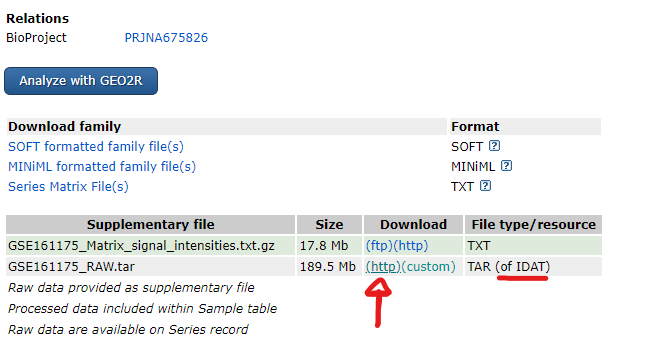
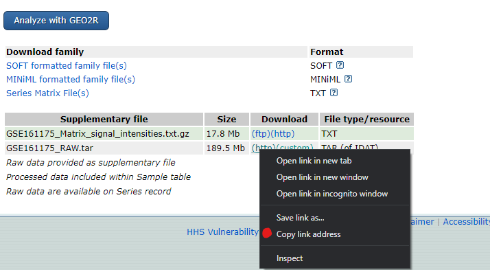

# IDAT file processing 

In this tutorial, you shall see how to convert 450k/EPIC array from IDAT files to beta-values - the DNA methylation levels. 

## Preparing packages 

```r
library(BiocManager)
library(IlluminaHumanMethylation450kanno.ilmn12.hg19)
library(shinyMethyl)
library(bumphunter)
library(IlluminaHumanMethylation450kmanifest)
library(minfi)
library(GEOquery)
library(HelpersMG)
```

## Download IDAT files from GEO (Gene Expression Omnibus)

You're probably already interested in a particular dataset. Download it by it's GSE. For this example, we will process GSE161175 dataset 





```r
setwd("your work directory")
wget("https://www.ncbi.nlm.nih.gov/geo/download/?acc=GSE161175&format=file") 
```

## Unzip the files

**NOTE**: it will depends on how the files came up from download. 
Here are 3 ways to unzip those files:

### #1.

```r
untar("file directory/?acc=GSE161175&format=file")
```

### #2.

```r
idatFiles <- list.files("file directory", pattern = "idat.gz$", full = TRUE, recursive = TRUE)
sapply(idatFiles, gunzip, overwrite = TRUE)
```

### #3.

```r
gzfile("file directory")
```
> Normally 1. followed by 2. is enough to unzip those files. Once while we need to try the 3. option. 


## Step 1: Read IDAT files 

```r
baseDir <- "file directory"  
idat.file <- read.metharray.exp(base = baseDir, targets = NULL, force = TRUE, recursive = T) 
```

### To visualize IDAT quality parameters 
> This visualizaiton step is just a formality.

```r
summary.idat <- shinySummarize(idat.file)
runShinyMethyl(summary.idat) 
```


## Step 2: Calculate p-values

```r
detP.idat <- detectionP(idat.file, type = "m+u") 
table(detP.idat > 0.05)
```


## Step 3: Preprocess the data

```r
proc.idat.file <- preprocessNoob(idat.file, offset = 0, dyeCorr = TRUE, verbose = TRUE, dyeMethod="reference")
```


## Step 4: Mask probes that failed p-value detection

```r
proc.idat.file.r <- ratioConvert(proc.idat.file)

is.na(assays(proc.idat.file.r)$Beta) <- (detP.idat[rownames(proc.idat.file.r), colnames(proc.idat.file.r)] > 0.05)
```


## Step 5: Retrieve beta-values

```r
beta.idat.file <- assays(proc.idat.file.r)$Beta
beta.idat.file  <- as.data.frame(beta.idat.file)
dim(beta.idat.file)
beta.idat.file[1,4,1:4]
save(beta.idat.file , file = "file directory/beta.idat.file.rda")
```

# END. 


