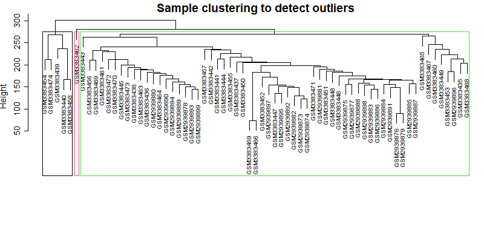
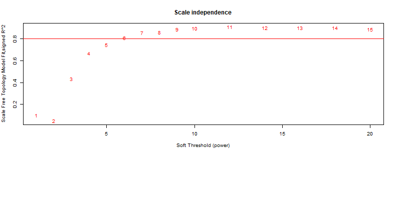
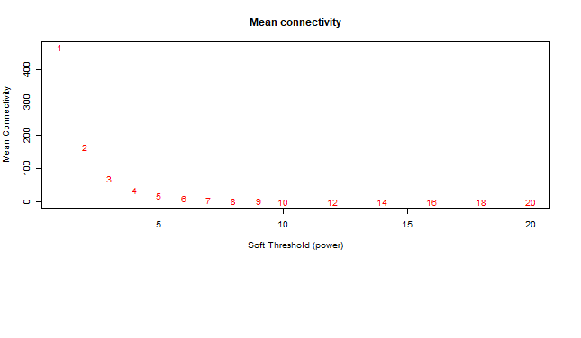
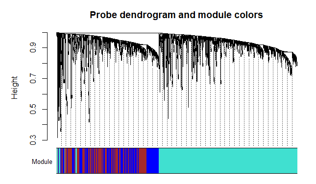
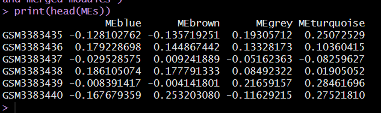
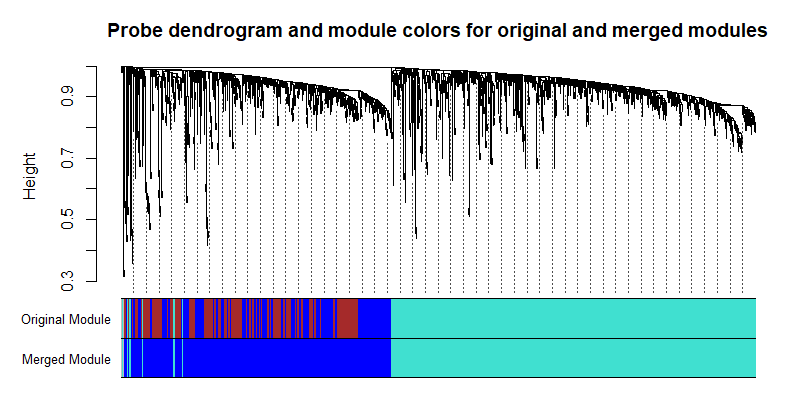

# Find co-correlated DNA methylation probes 

In this tutorial, we gonna find features (DNAmet probes) that might catch some phenotype on Glioblastoma Stem Cells (GSCs).
We will use the WGCNA package to compute the weighted correlation within GSCs.

## PC setup 
asdsadsadasdsadasdasdasdasd

## Preparing packages

```r
library(WGCNA)
library(meffil)
library(impute)

```

## Load GSC DNAmet matrix - I collected them from the GEO database (GSE109330 and GSE119774)

Obs: You should process those IDAT files, get beta-values, and then transform beta-values into M-values in order to get the DNAmet matrix below
M-values are better for this 'most variable feature'. They don't get too much perturbation compared to beta-values. 

```r
DNAmatrix = readRDS('./loads/67_GSC_Mvalue_DNAmet_matrix_GSE109330_GSE119774.rds')
dim(DNAmatrix) #452567     67
```

## Filter only Most Variable Features (features = DNAmet probes)

```r
require(meffil)
MostVF_GSC <- meffil.most.variable.cpgs(
  as.matrix(DNAmatrix),
  n = 2000, # you can choose more than that eg 10k most variable features
  sites = NULL,
  samples = NULL,
  autosomal = T,
  winsorize.pct = NA,
  outlier.iqr.factor = NA
)

length(MostVF_GSC) #2000

GSC_matrix_MVF <- DNAmatrix[MostVF_GSC,]
```

## Fix NAs 

Obs: for the sake of practice, we're gonna use only one of these two 'NA removal' strategies below (na.omit)
### Remove probes which got an NA (no M-value) at least for one sample

```r
GSC_matrix_MVF_naomit <- na.omit(GSC_matrix_MVF)
dim(MostVF_GSC_naomit) ##1901  67
```

### Replace NA through KNN (K-nearest neighbors)

```r
library(impute)
GSC_matrix_MVF__knn <- impute.knn(as.matrix(GSC_matrix_MVF), k = 10, rowmax = 0.8, colmax = 0.8, maxp = 1500, rng.seed=362436069)[[1]]
```

## Identify outliers 

### Probes outliers
```r
gsg <- goodSamplesGenes(t(GSC_matrix_MVF_naomit))
summary(gsg)
gsg$allOK # no outliers present
```

If gsg$allOK returns FALSE, do the following 

```r
if (!gsg$allOK)
{
  if (sum(!gsg$goodGenes)>0) 
    printFlush(paste("Removing genes:", paste(names(GSC_matrix_MVF_naomit)[!gsg$goodGenes], collapse = ", "))); #Identifies and prints outlier genes
  if (sum(!gsg$goodSamples)>0)
    printFlush(paste("Removing samples:", paste(rownames(GSC_matrix_MVF_naomit)[!gsg$goodSamples], collapse = ", "))); #Identifies and prints oulier samples
  GSC_matrix_MVF_naomit <- GSC_matrix_MVF_naomit[gsg$goodSamples == TRUE, gsg$goodGenes == TRUE] # Removes the offending genes and samples from the data
}
```

### Samples outliers

```r
sampleTree <- hclust(dist(t(GSC_matrix_MVF_naomit)), method = "average") 
# par(cex = 0.6);
# par(mar = c(0,4,2,0))
plot(sampleTree, main = "Sample clustering to detect outliers", sub="", xlab="", cex.lab = 1.5,
     cex.axis = 1.5, cex.main = 2)
rect.hclust(tree = sampleTree, k = 3, which = 1:3, border = 1:3)
```



If there is any sample outlier 

```r
cut.sampleTree <- cutreeStatic(sampleTree, cutHeight = 15, minSize = 10) 
GSC_matrix_MVF_naomit <- GSC_matrix_MVF_naomit[,cut.sampleTree==1] # Remove outlier
```


## Network Construction (Pairwise Gene Co-expression similarity)

### Soft-thresholding
```r
spt <- pickSoftThreshold(t(GSC_matrix_MVF_naomit)) 
```

### R^2 values as a function of the soft thresholds (power)
```r
par(mar=c(1,1,1,1))
plot(spt$fitIndices[,1],spt$fitIndices[,2],
     xlab="Soft Threshold (power)",ylab="Scale Free Topology Model Fit,signed R^2",type="n",
     main = paste("Scale independence"))
text(spt$fitIndices[,1],spt$fitIndices[,2],col="red")
abline(h=0.80,col="red")
```


### mean connectivity as a function of soft thresholds (power)
```r
par(mar=c(1,1,1,1))
plot(spt$fitIndices[,1], spt$fitIndices[,5],
     xlab="Soft Threshold (power)",ylab="Mean Connectivity", type="n",
     main = paste("Mean connectivity"))
text(spt$fitIndices[,1], spt$fitIndices[,5], labels= spt$fitIndices[,1],col="red")
```


Obs: We should maximize the R2 value and minimize mean connectivity
Choose a Power higher then a R^2 of 0.8 & the first lowest mean connectivity
In this case a Power = 5 is within a R^2 of 0.80 & also is the first lowest mean connectivity


### calling the Adjacency Function

```r
softPower <- 5
adjacency <- adjacency(t(GSC_matrix_MVF_naomit), power = softPower)
```


## Module Construction

### Defining Dissimilarity

```r
TOM <- TOMsimilarity(adjacency) #The current matrix gives us the similarity between genes
TOM.dissimilarity <- 1-TOM # Converting similarity matrix into a dissimilarity matrix
```

### Hierarchical Clustering Analysis

#### Creating the dendrogram 

```r
geneTree <- hclust(as.dist(TOM.dissimilarity), method = "average") 
```

#### Set minimum modulus (Authors of WGCNA recommend to start at a minClusterSize = 30)

```r
Modules <- cutreeDynamic(dendro = geneTree, distM = TOM.dissimilarity, deepSplit = 2, pamRespectsDendro = FALSE, minClusterSize = 30)

table(Modules) # probes by modulus
#Note: label modulo 0 is related to unassigned probes (when there is label 0)
#Modules 0    1    2    3 
#probes  5 1122  394  380 

ModuleColors <- labels2colors(Modules) #assigns each module number a color
table(ModuleColors) 
#blue     brown      grey turquoise 
#394       380         5      1122

#### plot the gene dendrogram with the module colors
plotDendroAndColors(geneTree, ModuleColors,"Module",
                    dendroLabels = FALSE, hang = 0.03,
                    addGuide = TRUE, guideHang = 0.05,
                    main = "Probe dendrogram and module colors")
```                   



## Module Eigengene/Eigenprobe (ME) Identification

I just bored the terms used for gene expression to DNA methylation 
A ME (Module Eigenprobe) is the standardized probe methylation level profile for a given module
EigenProbes represent the DNA methylation level of the majority of probes within a module.

```r
MElist <- moduleEigengenes(t(GSC_matrix_MVF_naomit), colors = ModuleColors) 
MEs <- MElist$eigengenes 
print(head(MEs))
```


These are Eigenprobes (sample score by module)


## Module Merging

### Merge the modules that have similar expression profiles (more meaningful modules)

```r
ME.dissimilarity = 1-cor(MElist$eigengenes, use="complete") #Calculate eigenprobe dissimilarity

METree = hclust(as.dist(ME.dissimilarity), method = "average") #Clustering eigenprobe
par(cex = 0.8);
par(mar = c(0,4,4,0))
plot(METree)
abline(h=.25, col = "red") #a height of .25 corresponds to correlation of .75

[image] [image] [image] [image] [image] [image] [image] [image] [image] [image] [image] [image]
The plot above shows all of the modules which have more than 75% similarity (all modules below the abline)

merge <- mergeCloseModules(t(GSC_matrix_MVF_naomit), ModuleColors, cutHeight = .25) #merging modulus
mergedColors = merge$colors # The merged module colors, assigning one color to each module
mergedMEs = merge$newMEs # Eigengenes of the new merged modules
```

### Comparing the original modules against the merged ones

```r
plotDendroAndColors(geneTree, cbind(ModuleColors, mergedColors), 
                    c("Original Module", "Merged Module"),
                    dendroLabels = FALSE, hang = 0.03,
                    addGuide = TRUE, guideHang = 0.05,
                    main = "Probe dendrogram and module colors for original and merged modules")




The merged modules are your network
```

## Extract probes from a specific module

```r
probes_modulos <- as.data.frame(c(rownames(GSC_matrix_MVF_naomit)))
probes_modulos$modulos <- mergedColors

table(probes_modulos$modulos)
#blue      grey turquoise 
#774         5      1122

#Select the module within the most probes, for instance
probes_biggest_module <- subset(probes_modulos, modulos %in% "turquoise")

save(probes_biggest_module, file = "./moduleX_probes.rds")
```

## Possible usage for the WGCNA/co-correlation analysis 

1. Get the probe set from the biggest module if you're looking for a particular phenotype to your samples

2. Use Eigenprobes values to correlate to metadata information 

3. Correlate Eigenprobe values from these GSC samples against another sample group (Eigenprobe values) of your interest. For that, you must run this analysis to the other sample group.

Look. It's either possible to generate a probe set based on the samples of your choice or based on a probe set you're interested in. Therefore, there are a lot of options for this kind of analysis. Be creative, but be consistent and do never p-hack ;]


